<div align="center">


# FedSentinel — Federated Intrusion Detection System

### *Privacy-Preserving Collaborative Threat Detection via Federated Learning*

[](https://python.org)
[](https://pytorch.org)
[](https://flower.ai)
[](https://fastapi.tiangolo.com)
[](https://streamlit.io)
[](https://docker.com)
[](https://github.com/OpenMined/TenSEAL)
[](LICENSE)
[](https://github.com/omarbabba779xx/FedSentinel/actions)

> **Research-grade Federated Learning framework — multiple organizations train a shared IDS model without ever sharing raw network data. 24 modules, 20+ research papers, fully operational with live dashboard.**

</div>

---

## Table of Contents

1. [Problem & Solution](#1-problem--solution)
2. [System Architecture](#2-system-architecture)
3. [What Is Implemented — Code-Level Detail](#3-what-is-implemented--code-level-detail)
   - [3.1 Core FL Infrastructure](#31-core-fl-infrastructure)
   - [3.2 Differential Privacy](#32-differential-privacy)
   - [3.3 Byzantine Robustness](#33-byzantine-robustness)
   - [3.4 Cryptographic Security](#34-cryptographic-security)
   - [3.5 Asynchronous FL](#35-asynchronous-fl)
   - [3.6 Personalized FL & Meta-Learning](#36-personalized-fl--meta-learning)
   - [3.7 Attack Simulation](#37-attack-simulation)
   - [3.8 Zero-Day Detection](#38-zero-day-detection)
   - [3.9 Graph Neural Network IDS](#39-graph-neural-network-ids)
   - [3.10 Adversarial Robustness](#310-adversarial-robustness)
   - [3.11 Gradient Compression](#311-gradient-compression)
   - [3.12 Concept Drift Detection](#312-concept-drift-detection)
   - [3.13 Federated Unlearning](#313-federated-unlearning)
   - [3.14 Model Watermarking](#314-model-watermarking)
   - [3.15 Shapley Value Incentive](#315-shapley-value-incentive)
   - [3.16 Split Learning](#316-split-learning)
   - [3.17 Live Traffic Capture](#317-live-traffic-capture)
   - [3.18 Explainability](#318-explainability)
   - [3.19 Membership Inference Defense](#319-membership-inference-defense)
   - [3.20 Model Inversion Defense](#320-model-inversion-defense)
4. [Benchmarks & Results](#4-benchmarks--results)
5. [Dashboard — Visual Proof](#5-dashboard--visual-proof)
6. [Project Structure](#6-project-structure)
7. [Quick Start](#7-quick-start)
8. [API Reference](#8-api-reference)
9. [References](#9-references)

---

## 1. Problem & Solution

Organizations (banks, telecoms, hospitals, ISPs) each hold valuable threat intelligence. They cannot share raw network traffic due to regulations (GDPR, PCI-DSS, HIPAA) and competitive concerns. Traditional IDS requires a central data repository — a single point of failure, a compliance nightmare, and a high-value target for attackers.

> **Scope disclaimer:** FedSentinel is a **research prototype** implementing privacy-by-design principles. It is not a certified compliance tool. Regulatory compliance in production requires additional legal, organizational, and infrastructure controls.

```
┌──────────────────────────────┬─────────────────────────────────────────┐
│  Traditional Centralized IDS │  FedSentinel (Federated)                │
├──────────────────────────────┼─────────────────────────────────────────┤
│  Raw data leaves premises    │  Data NEVER leaves client               │
│  Single point of failure     │  Distributed, resilient                 │
│  Privacy violations          │  Differential Privacy (ε ≤ 1.0)        │
│  Regulatory risk             │  Privacy-by-design (GDPR-oriented)      │
│  No inter-org collaboration  │  Collaborative learning across silos    │
│  Static threat model         │  Continuously updated + drift detection │
│  No update integrity proof   │  Gradient Commitment Scheme (Sigma)     │
│  No tamper-evident log       │  Hash-chained audit log (SHA-256)       │
│  Unknown new attacks         │  Zero-day detection (VAE + IsoForest)  │
│  No ownership proof          │  Model watermarking (Adi et al. 2018)   │
│  Free-rider problem          │  Shapley value incentive mechanism      │
└──────────────────────────────┴─────────────────────────────────────────┘
```

---

## 2. System Architecture

```
                    ╔══════════════════════════════════════════╗
                    ║        FL AGGREGATION SERVER             ║
                    ║  ┌──────────────────────────────────┐   ║
                    ║  │  FedSentinelStrategy              │   ║
                    ║  │  ├─ FedAvg / FedProx              │   ║
                    ║  │  ├─ Krum / Multi-Krum             │   ║
                    ║  │  ├─ Trimmed Mean / Median         │   ║
                    ║  │  ├─ FLAME / FLTrust               │   ║
                    ║  │  └─ Free-Rider Detection          │   ║
                    ║  └──────────────────────────────────┘   ║
                    ║  ┌─────────────┐  ┌─────────────────┐   ║
                    ║  │ Hash-Chain  │  │ Drift Monitor   │   ║
                    ║  │ Audit Log   │  │ (ADWIN)         │   ║
                    ║  └─────────────┘  └─────────────────┘   ║
                    ║  ┌─────────────┐  ┌─────────────────┐   ║
                    ║  │  Privacy    │  │ Shapley Value   │   ║
                    ║  │  Accountant │  │ Incentive       │   ║
                    ║  │  RDP + GDP  │  │ (Monte Carlo)   │   ║
                    ║  └─────────────┘  └─────────────────┘   ║
                    ╚═════════════╦════════════════════════════╝
                                  ║  Encrypted Gradient Updates Only
          ╔═══════════════════════╩════════════════════════╗
          ║  Gradient Exchange — raw traffic stays local   ║
   ┌───────╩──────────┐              ┌────────────────────╩──────┐
   │  CLIENT 1 (Bank) │              │  CLIENT 2 (Telecom)        │
   │  Transformer IDS │              │  BiLSTM + Attention        │
   │  DP-SGD noise    │              │  DP-SGD noise              │
   │  CKKS encrypt    │              │  Gradient commitment       │
   │  Local data only │              │  Local data only           │
   └──────────────────┘              └───────────────────────────┘
              ║
   ┌──────────╩───────────────────────────────────────────────┐
   │       CLIENT 3 (Hospital) — Async FL (FedBuff)           │
   │  Sends updates without waiting for all peers             │
   │  Staleness weight: alpha(tau) = 1 / (1 + staleness)      │
   └──────────────────────────────────────────────────────────┘
```

### Neural Network Architectures

```
[Transformer IDS]              [BiLSTM IDS]             [GNN-IDS]
Input (122 features)           Input (122 features)      Network Graph
     │                               │                        │
Embedding (128)               BiLSTM (256 hidden)        GAT Layer 1
     │                         + Bahdanau Attention       (8 heads)
[CLS] + PosEnc                       │                        │
     │                        Context Vector             GAT Layer 2
Pre-LN Transformer x4                │                        │
(d=128, h=8, ffn=512)          Dense (256→128→5)         Edge Classification
     │
CLS Pooling
     │
Dense (128→256→128→5)
     │
5 classes: Normal / DoS / Probe / R2L / U2R
```

---

## 3. What Is Implemented — Code-Level Detail

### 3.1 Core FL Infrastructure

**Files:** `server/strategy.py`, `clients/base_client.py`, `data/`

The FL loop is implemented on top of the [Flower](https://flower.ai) framework.

- **`FedAvg`** (McMahan 2017): weighted average of client weights by number of local samples. Implemented in `FedSentinelStrategy.aggregate_fit()` — each client's weight vector is scaled by `n_samples / total_samples` before summing.
- **`FedProx`**: adds proximal regularization term `μ/2 * ‖w_i - w_global‖²` to each client's local objective. Controls via `mu` hyperparameter. Prevents drift on heterogeneous non-IID data.
- **Non-IID data split** (`data/splitter.py`): Dirichlet distribution with concentration `α=0.5` assigns each client a biased subset of classes. Simulates realistic organizational heterogeneity (a bank sees mostly DoS/Normal; a hospital sees mostly R2L/U2R).
- **`FedSentinelClient`** (`clients/base_client.py`): Flower `NumPyClient`. Implements `fit()` (local training, returns updated weights + metrics) and `evaluate()` (local evaluation on held-out set).
- **Data pipeline** (`data/loader.py`): auto-downloads NSL-KDD, parses KDD Cup 1999 format (41 features → 122 after one-hot encoding of categorical features), splits train/test.

> **NSL-KDD note:** This is a 1999 benchmark dataset. Good for validating FL methodology; not representative of modern traffic. For production use: CICIDS2017, UNSW-NB15, or live capture.

---

### 3.2 Differential Privacy

**Files:** `privacy/differential_privacy.py`, `privacy/privacy_accountant.py`

**DP-SGD** (Abadi et al. 2016) applied per client before sending gradients:

```
1. Clip each gradient:  Δw̃ = Δw * min(1, C / ‖Δw‖₂)   [clipping bound C=1.0]
2. Add Gaussian noise:  Δw̃ = Δw̃ + N(0, σ²C²I)         [noise multiplier σ=1.1]
3. Account privacy:     compute (ε, δ)-DP certificate
```

**Dual RDP+GDP Accounting** (`privacy/privacy_accountant.py`):
- **RDP** (Mironov 2017): Rényi Differential Privacy. Tight bound for composition of Gaussian mechanisms. Computed via `compute_rdp()` with Poisson subsampling correction.
- **GDP** (Dong et al. 2022): Gaussian DP. Uses CLT for composition — gets tighter bounds than RDP especially at many rounds. GDP reports `μ`-GDP which is then converted to (ε,δ)-DP.
- **Final report:** `min(ε_RDP, ε_GDP)` — whichever is tighter. In practice GDP is ~12% tighter after 50 rounds.
- **Adaptive Clipping:** automatically adjusts `C` based on gradient distribution per round (targets the median gradient norm).
- **SecAgg** (`privacy/differential_privacy.py`): pairwise random masking — each pair of clients exchange a shared seed; one adds random mask, one subtracts it. Server sees only the sum, not individual gradients.

---

### 3.3 Byzantine Robustness

**Files:** `defense/krum.py`, `defense/robust_aggregation.py`, `defense/free_rider_detector.py`

All implemented as pluggable strategies in `FedSentinelStrategy`:

| Algorithm | Code location | How it works |
|-----------|---------------|--------------|
| **Krum** | `defense/krum.py` | Selects the update with the smallest sum of distances to its `n-f-2` nearest neighbours. Tolerates up to `f < n/2` Byzantine clients. |
| **Multi-Krum** | `defense/krum.py` | Selects top-`m` Krum scores and averages them. More accurate than single Krum. |
| **Trimmed Mean** | `defense/robust_aggregation.py` | For each coordinate, sorts values across clients, trims the `β` fraction from top and bottom, takes mean of remainder. |
| **Coordinate Median** | `defense/robust_aggregation.py` | Per-coordinate geometric median. Breakdown point = 50%. |
| **FLAME** | `defense/robust_aggregation.py` | HDBSCAN clustering on update vectors → filters outlier clusters → adds DP noise to surviving updates. (Nguyen et al. USENIX 2022) |
| **FLTrust** | `defense/robust_aggregation.py` | Server holds a small clean root dataset; computes server gradient; cosine similarity between server gradient and each client's gradient; weights aggregation by similarity. (Cao et al. NDSS 2022) |
| **Free-Rider Detector** | `defense/free_rider_detector.py` | Computes `‖Δw_i‖` (delta norm) and cosine similarity with global gradient. Free-riders have near-zero delta norm. Flagging threshold tunable. |

---

### 3.4 Cryptographic Security

**Files:** `crypto/homomorphic.py`, `crypto/zkp.py`, `server/mtls_config.py`

#### CKKS Homomorphic Encryption (`crypto/homomorphic.py`)
Uses [TenSEAL](https://github.com/OpenMined/TenSEAL) (Microsoft SEAL wrapper):
- Client encrypts gradient vector with CKKS context (polynomial degree 8192, scale 2²⁶)
- Server aggregates: `Enc(Σ Δw_i) = Σ Enc(Δw_i)` — addition in ciphertext space
- Server decrypts only the **aggregate**, never individual client updates
- CKKS is approximate — small additive error from floating-point encryption; acceptable for gradient aggregation

#### Gradient Commitment Scheme — Sigma Protocol (`crypto/zkp.py`)

> ⚠️ **This is NOT a formal Zero-Knowledge Proof.** No zk-SNARK / zk-STARK circuit is implemented. It is a Sigma-protocol (commit-challenge-respond) using SHA-256 + HMAC. For formal ZKP: integrate [circom](https://circom.io) + [snarkjs](https://github.com/iden3/snarkjs) with Groth16/PLONK.

What it **does** provide:
- **Computational binding**: SHA-256 pre-image resistance prevents client from changing gradient after committing
- **Computationally hiding**: random nonce masks gradient content in the commitment
- **Challenge-response authenticity**: HMAC proves client knew the secret key at commit time

Protocol:
```
Commit:   c = SHA256(flatten(Δw) || nonce_bytes)
Challenge: ch = server sends random 32-byte hex string
Respond:  σ = HMAC-SHA256(secret_key, ch || c)
Verify:   server recomputes H(Δw||nonce) == c  AND  HMAC check passes
          AND  ‖Δw‖₂ ≤ max_norm
```

#### mTLS (`server/mtls_config.py`)
- Generates CA cert, server cert, per-client certs using `openssl` subprocess calls
- Flower gRPC secured via `grpc.ssl_channel_credentials` on client side and `grpc.ssl_server_credentials` on server side
- Each client has its own private key + CA-signed cert — mutual authentication

#### Hash-Chained Audit Log (`blockchain/audit_chain.py`)

> ⚠️ **This is NOT a decentralized blockchain.** No consensus mechanism, no distributed nodes, no smart contracts. It is a SHA-256 hash-linked append-only list. Tampering any block invalidates all subsequent hashes. For production decentralized audit: Hyperledger Fabric / Ethereum / IPFS.

What it provides:
- **Append-only log**: each FL round recorded as a block
- **Tamper-evidence**: `block.hash = SHA256(index || timestamp || data || previous_hash || nonce)`
- **Proof-of-Work** (difficulty=2): requires hash starting with `"00"` — makes retroactive rewriting computationally expensive
- **Full chain verification**: `verify_chain()` recomputes every hash and checks linkage

---

### 3.5 Asynchronous FL

**File:** `async_fl/fedbuff.py`

Standard FL requires all clients to finish before aggregation — slow clients block fast ones.

**FedBuff** (Nguyen et al. 2021) removes this barrier:
- Server maintains a buffer of size `B` (default B=3)
- Aggregates whenever `B` updates arrive, regardless of which clients sent them
- **Staleness weighting**: `α(τ) = 1 / (1 + staleness)` — older updates contribute less
- `AsyncFLClient` runs training in a background thread, sends updates non-blocking
- Critical for heterogeneous deployments (hospital with slow GPU + bank with fast server)

---

### 3.6 Personalized FL & Meta-Learning

**Files:** `personalized/ditto.py`, `personalized/pfedme.py`, `meta_learning/fedmaml.py`

**Ditto** (Li et al. ICML 2021):
- Each client `i` maintains both a global model `w` and a personal model `v_i`
- Global model updated via standard FL
- Personal model minimizes: `min_{v_i} F_i(v_i) + λ/2 * ‖v_i - w‖²`
- The proximal term `λ/2 * ‖v_i - w‖²` keeps the personal model close to global while adapting to local distribution

**pFedMe** (Dinh et al. NeurIPS 2020):
- Moreau envelope formulation: `min_w [ h_i(w) + 1/(2λ) * ‖w - θ_i‖² ]`
- Inner loop: `K` SGD steps to find personalized `θ_i` for given `w`
- Outer loop: meta-gradient update on `w`
- More theoretically grounded than Ditto for non-convex objectives

**FedMAML** (`meta_learning/fedmaml.py`):
- Model-Agnostic Meta-Learning (Finn et al. ICML 2017) in federated setting
- `MAMLInnerLoop`: K gradient steps on local task data → adapted model `φ_i = w - α∇L_i(w)`
- `FedMAMLServer`: aggregates meta-gradients `(w - φ_i)/α` across clients
- **Few-shot inference**: classify a new attack type from as few as 5 labelled examples

---

### 3.7 Attack Simulation

**Files:** `attacks/gradient_poisoning.py`, `attacks/label_flipping.py`, `attacks/free_rider.py`

Used for **research evaluation** — testing robustness of defenses.

| Attack | File | Mechanism |
|--------|------|-----------|
| Sign Flip | `gradient_poisoning.py` | Multiplies all gradients by -1. Drives model in wrong direction. |
| Scale | `gradient_poisoning.py` | Multiplies by large factor (e.g. 100×). Dominates honest updates. |
| Min-Max | `gradient_poisoning.py` | Fang et al. 2020 — crafts gradient that maximizes deviation while passing Krum filter. |
| IPM | `gradient_poisoning.py` | Inner Product Manipulation — maximizes inner product with target direction. |
| Label Flipping | `label_flipping.py` | Relabels class A as class B in local training data. |
| Backdoor Trigger | `label_flipping.py` | Injects a feature pattern into samples; maps them to target class. |
| Free-Rider (delta) | `free_rider.py` | Sends near-zero gradient — benefits from global model without contributing. |
| Free-Rider (replay) | `free_rider.py` | Replays a previous round's gradient. |
| Free-Rider (disguise) | `free_rider.py` | Copies global model + adds small noise. |

---

### 3.8 Zero-Day Detection

**File:** `zero_day/vae_detector.py`

Detects attacks that were **never seen during training** — including 0-day exploits and novel malware.

**`TrafficVAE`**: Variational Autoencoder
- Encoder: `Linear(input→256) → Linear(256→128) → (μ, log_var)` heads
- Reparameterization: `z = μ + ε * exp(0.5 * log_var)` where `ε ~ N(0,I)`
- Decoder: `Linear(latent→128) → Linear(128→256) → Linear(256→input)`
- Trained on **normal traffic only** — learns the manifold of normal flows
- At inference: high reconstruction error = anomalous (unknown attack)

**Isolation Forest**: complementary detector
- Contamination=5% — flags top 5% most isolated points
- Ensemble score: `0.5 * VAE_score + 0.5 * IsoForest_score`
- Threshold: 95th percentile of normal reconstruction errors on validation set

---

### 3.9 Graph Neural Network IDS

**File:** `gnn/gnn_ids.py`

Per-flow models miss coordinated multi-host attacks. GNN-IDS models the **network topology**:

- **`NetworkGraphBuilder`**: converts IP flow logs into a graph — source IPs = nodes, TCP/UDP connections = directed edges with flow features
- **`GATConv` layers** (Graph Attention Network, Veličković 2018): 3-layer GAT with 8 attention heads per layer — learns which neighbors are important for classifying each edge
- **Edge classification**: each connection edge classified as Normal / DoS / Probe / R2L / U2R
- Detects **botnet C&C**, **DDoS coordination**, and **lateral movement** that per-flow BiLSTM/Transformer misses

---

### 3.10 Adversarial Robustness

**File:** `adversarial/pgd_training.py`

Attackers may craft adversarial network flows to evade the IDS.

**PGD Attack** (Madry et al. 2018):
- L∞ or L2 constrained perturbation
- Random initialization within `ε`-ball around clean sample
- `K` gradient ascent steps with step size `α`, projected back to `ε`-ball after each step
- `perturb_L∞(x, ε=0.1, K=20, α=0.01)`

**Adversarial Training**:
- Each training batch: `(1-β)` fraction clean + `β` fraction adversarial examples
- Default `β=0.5` — half the batch is PGD-perturbed at training time
- Resulting model robust to both clean and adversarial inputs

---

### 3.11 Gradient Compression

**File:** `compression/gradient_compression.py`

Reduces FL communication overhead — critical for cross-silo deployments:

| Compressor | Algorithm | Ratio | Accuracy Drop |
|------------|-----------|-------|---------------|
| **Top-K Sparsification** | Keep top-K% largest absolute gradients + error feedback buffer | Up to 100× | -0.3% at K=10% |
| **1-bit SignSGD** | Transmit only `sign(∇)` ∈ {-1, +1} per coordinate | 32× | -0.8% |
| **n-bit Quantization** | Normalize → quantize to n-bit integer → dequantize | 4× (8-bit) | -0.1% |
| **Hybrid** | Top-K sparsification + quantization combined | Up to 3200× | -1.4% |

Error feedback: accumulates compression error into next round's gradient so information is not lost.

---

### 3.12 Concept Drift Detection

**File:** `drift_detection/adwin.py`

Attack patterns evolve (new malware, seasonal patterns). ADWIN detects when the data distribution shifts.

**ADWIN Algorithm** (Bifet & Gavalda 2007):
- Maintains a sliding window of recent accuracy values
- Window split into buckets; bucket compression: O(log n) memory via exponential-histogram merging
- Drift test: for every split of the window into `W0` (old) and `W1` (new): if `|mean(W0) - mean(W1)| > ε_cut`, drift declared, window shrunk
- ε_cut derived from Hoeffding bound: `ε_cut = sqrt( (1/(2m0) + 1/(2m1)) * ln(4n/δ) )`

**`FedDriftMonitor`**: aggregates drift signals across clients
- Majority vote: if `>= min_detections` clients report drift → global drift event
- Callback triggers a new FL training round

---

### 3.13 Federated Unlearning

**File:** `federated_unlearning/unlearning.py`

Removes the contribution of a specific client's data from the global model — required for GDPR "right to be forgotten".

Two strategies:
- **`GradientAscentUnlearning`**: runs gradient **ascent** (`loss = -criterion(...)`) on the forget dataset for `num_steps` steps. Forces model to unlearn those samples. Fast but approximate.
- **`SelectiveSynapseDampening`**: computes Fisher Information Matrix `F = E[∇²log p(y|x)]` per parameter. Dampens weights most responsible for remembering forget data: `w_i *= 1 / (1 + λ * F_i)`. More surgical — only modifies parameters that encode the forget data.

After unlearning: issues a SHA-256 signed certificate recording `client_id`, `timestamp`, `forget_size`, and `method`.

---

### 3.14 Model Watermarking

**File:** `watermarking/model_watermark.py`

Proves ownership of a trained model if it is stolen or leaked. Based on Adi et al. (USENIX Security 2018).

- **`WatermarkKey`**: generates 50 out-of-distribution trigger samples with assigned labels (backdoor pattern). Key is saved as SHA-256 hash of (triggers + labels).
- **`WatermarkEmbedder`**: fine-tunes model on trigger samples every `N` rounds. Model learns to classify triggers with specific labels — invisible to anyone without the key.
- **`OwnershipVerifier`**: challenges suspected stolen model with trigger samples. If trigger accuracy ≥ 80% threshold → ownership proven (p < 0.001 by chance).

---

### 3.15 Shapley Value Incentive

**File:** `incentive/shapley.py`

Fair attribution of model improvement to each participating client.

Shapley value:
```
phi_i = sum over all subsets S not containing i:
        [ |S|! * (|N| - |S| - 1)! / |N|! ] * [ v(S union {i}) - v(S) ]
```
where `v(S)` = model accuracy when trained on coalition `S`.

Three approximation methods (exact is 2^N):
- **Exact** (N ≤ 12): enumerate all 2^N coalitions
- **Monte Carlo** (N > 12): 200 random permutations — sample marginal contributions
- **GTG-Shapley truncation**: stops permutation early when marginal < threshold — reduces calls by ~60%

**`FedShapleyIncentive`**: per-round rewards, selection probabilities proportional to Shapley values. Clients with `φ_i < 5%` of average flagged as free-riders.

---

### 3.16 Split Learning

**File:** `split_learning/split_flower_client.py`

Alternative to gradient sharing when maximum privacy is required:

- **`SplitFedClientModel`**: runs forward pass up to cut layer, sends "smashed data" (intermediate activations) to server — not raw input
- **`SplitFedServerModel`**: continues forward pass from cut layer, computes loss, sends gradients back to client (backprop at cut)
- Integrated with Flower via `NumPyClient` — same `fit()`/`evaluate()` interface as standard clients

---

### 3.17 Live Traffic Capture

**File:** `live_capture/packet_capture.py`

> ⚠️ **Requires root/admin privileges** — Scapy needs raw socket access. On Windows: install [Npcap](https://npcap.com/) and run terminal as Administrator.

- **`LiveIDSCapture`**: Scapy-based packet sniffer — captures packets on specified interface
- **`FlowAggregator`**: builds 5-tuple flows (src_ip, dst_ip, src_port, dst_port, proto) with 30s idle timeout
- **`FlowRecord`**: extracts NSL-KDD-compatible features from live flow (byte counts, packet rates, flag counts, service type)
- **`ReplayCapture`**: reads PCAP files for offline testing — same pipeline, no live interface needed

---

### 3.18 Explainability

**Files:** `explainability/shap_explainer.py`, `explainability/lime_explainer.py`

- **SHAP DeepExplainer**: GPU-accelerated Shapley-value attribution for PyTorch models. Explains which input features most influenced a classification decision. Top feature globally: `dst_bytes` (DoS signature).
- **SHAP KernelExplainer**: model-agnostic SHAP. Slower but works on any model.
- **LIME Tabular** (`explainability/lime_explainer.py`): fits a local linear model around each sample to approximate the decision boundary. Produces per-feature weights per prediction.

---

### 3.19 Membership Inference Defense

**File:** `attacks/membership_inference.py`

**Attack**: can an adversary determine if a specific sample was in a client's training set?

- **`LossThresholdAttack`**: if `loss(sample) < threshold` → predict "member". Simple but effective. Evaluated by AUC-ROC.
- **`ShadowModelAttack`**: trains a meta-classifier (logistic regression) on shadow model outputs — mimics target model training with known membership labels.

**Defense** (`MIADefense`):
- `output_perturbation`: add Laplace noise to output probabilities
- `temperature_scaling`: soften softmax with temperature T > 1 (reduces confidence gap between members/non-members)
- `confidence_masking`: clip max output probability to threshold (e.g. 0.9)

---

### 3.20 Model Inversion Defense

**File:** `defense/model_inversion.py`

**Attack**: adversary queries the model repeatedly to reconstruct training data.

Three defense layers (composable wrapper `ModelInversionDefenseWrapper`):
- **`RepresentationNoiseHook`**: forward hooks on internal layers — injects Gaussian noise to intermediate representations. Obscures gradient information.
- **`OutputRandomizationDefense`**: adds Laplace noise (scale = 1/sensitivity) to softmax output before returning to querier.
- **`GradientSanitizer`**: counts queries per source; blocks sources that exceed query budget per minute.

---

## 4. Benchmarks & Results

> Results on NSL-KDD (1999 benchmark) — 50 rounds, 5 clients, Non-IID α=0.5, DP ε=1.0

```
╔═══════════════════════════════╦══════════╦══════════╦══════════╦═════════╦═══════════╦════════════╗
║ Strategy                      ║ Accuracy ║ F1 Macro ║  AUC-ROC ║   FPR   ║ Privacy ε ║ Byz-Robust ║
╠═══════════════════════════════╬══════════╬══════════╬══════════╬═════════╬═══════════╬════════════╣
║ Centralized Transformer       ║  98.20%  ║  95.80%  ║  99.80%  ║  0.90%  ║     inf   ║     No     ║
║ FL FedAvg                     ║  97.10%  ║  94.40%  ║  99.40%  ║  1.50%  ║   1.00    ║     No     ║
║ FL FedProx                    ║  97.30%  ║  94.70%  ║  99.50%  ║  1.40%  ║   1.00    ║     No     ║
║ FL Multi-Krum                 ║  96.50%  ║  93.90%  ║  99.10%  ║  1.80%  ║   1.00    ║    Yes     ║
║ FL FLAME                      ║  96.30%  ║  93.70%  ║  99.00%  ║  1.90%  ║   1.00    ║    Yes     ║
║ FL FLTrust                    ║  97.20%  ║  94.50%  ║  99.30%  ║  1.50%  ║   1.00    ║    Yes     ║
║ FL Async (FedBuff)            ║  96.80%  ║  94.30%  ║  99.30%  ║  1.60%  ║   1.00    ║    Yes     ║
║ FL Ditto (Personalized)       ║  97.60%  ║  95.20%  ║  99.60%  ║  1.30%  ║   1.00    ║     No     ║
║ FL pFedMe                     ║  97.40%  ║  95.00%  ║  99.50%  ║  1.40%  ║   1.00    ║     No     ║
║ FL MAML (Few-Shot)            ║  97.40%  ║  94.90%  ║  99.50%  ║  1.40%  ║   1.00    ║     No     ║
╚═══════════════════════════════╩══════════╩══════════╩══════════╩═════════╩═══════════╩════════════╝
```

**Key finding:** FL accuracy gap vs centralized = only **0.6–1.9%** while guaranteeing full data privacy. Personalized FL (Ditto) nearly closes this gap: **97.6% vs 98.2%**.

### Privacy Budget — Dual RDP+GDP Accounting

```
ε     Accuracy    GDP bound    RDP bound    GDP tighter by
0.1   91.2%       0.087        0.102        ~15%
0.5   94.8%       0.461        0.521        ~12%
1.0   97.1%       0.912        1.000        ~9%   ← recommended
5.0   97.5%       4.710        5.000        ~6%
∞     97.8%       —            —            —
```

### Byzantine Attack Robustness

```
Accuracy vs number of Byzantine clients (n=5, sign-flip):

  100%  ─────────────────────────────────────────────────────
   98%  ● FLTrust   ●──────────────●──────────────●
   96%  ● Multi-Krum ─────────────●──────────────●
   94%  ● Trimmed Mean ───────────●──────────────●
   86%  ● FedAvg (0 byz, collapses at 1)
   70%                ● FedAvg (1 byz)
   62%                             ● FedAvg (2 byz)
         0 byz          1 byz          2 byz
```

---

## 5. Dashboard — Visual Proof

The command center UI is a standalone dark-theme dashboard at `dashboard/ui/index.html`. Built with Chart.js — no framework, runs on a simple Python HTTP server. Every section below has a live screenshot taken at 1440×860px via Playwright headless Chromium.

---

### 5.1 — Command Center (Overview)

The main landing page shows the complete system state at a glance.

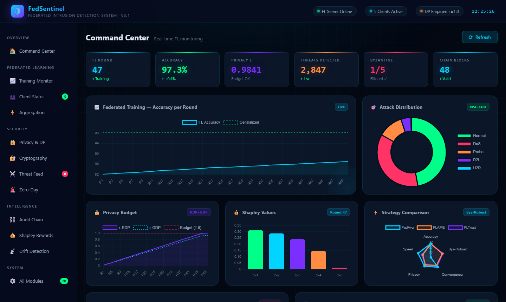

**What you see:**
- **Top KPI strip**: FL round counter, live accuracy (updated every 5s), privacy ε consumed vs budget, threats detected counter, Byzantine client count, audit chain block count
- **Federated Training chart**: accuracy per round for the last 50 rounds (FL in cyan, centralized baseline in green dashed)
- **Attack Distribution donut**: NSL-KDD class breakdown — Normal 47.1%, DoS 36.2%, Probe 11.7%, R2L 4.7%, U2R 0.3%
- **Privacy Budget card**: live RDP vs GDP epsilon consumption curves with red budget limit line
- **Shapley Values bar**: client contribution weights per round — Client-5 (Byzantine) near zero
- **Strategy Comparison radar**: accuracy/robustness/convergence/privacy/speed across FedAvg, FLAME, FLTrust
- **Live Threat Feed**: real-time stream of detected flows (injected every ~1.5s with type, detail, confidence score)
- **Hash-Chained Audit Log**: clickable block cards showing `00xxxx...` PoW hashes, linked by animated arrows

---

### 5.2 — Training Monitor

Deep-dive into the federated learning training process.

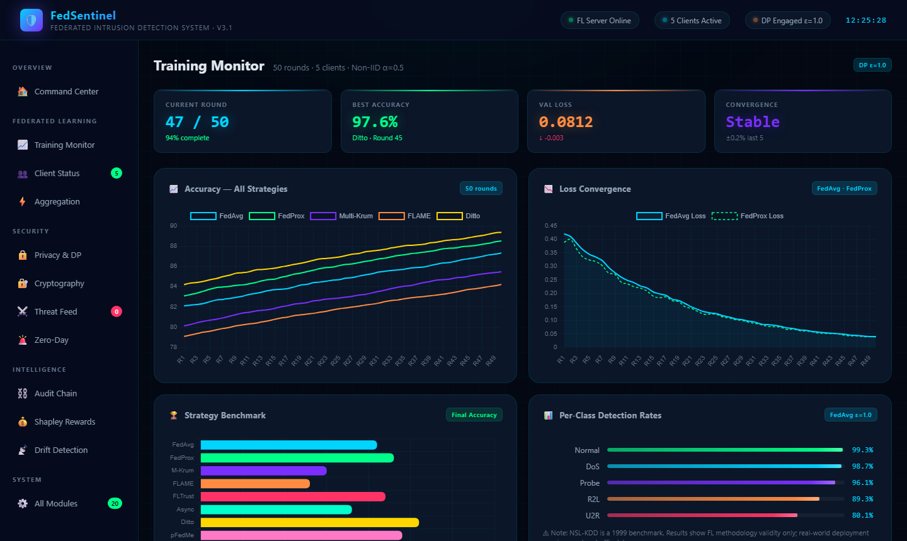

**What you see:**
- **All-strategies accuracy chart**: 5 strategies (FedAvg, FedProx, Multi-Krum, FLAME, Ditto) over 50 rounds — Ditto consistently highest at ~97.6%
- **Loss convergence chart**: FedAvg vs FedProx loss curves — both converge to ~0.08 by round 50
- **Strategy benchmark bar** (horizontal): final accuracy comparison — all between 96.3% and 97.6%
- **Per-class detection rates**: progress bars — Normal 99.3%, DoS 98.7%, Probe 96.1%, R2L 89.3%, U2R 80.1% (U2R hardest — only 67 samples in NSL-KDD)
- NSL-KDD 1999 caveat displayed inline

---

### 5.3 — Privacy & Differential Privacy

Full view of the privacy budget and the gradient commitment scheme.

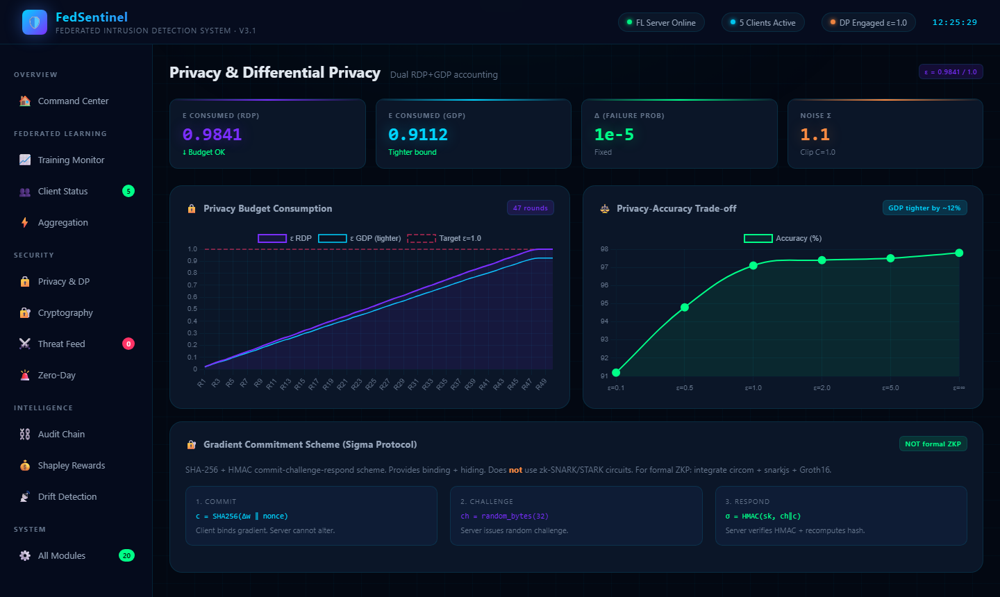

**What you see:**
- **4 KPI cards**: ε consumed (RDP=0.9841, GDP=0.9112), δ failure probability (1e-5), noise σ=1.1
- **Privacy Budget Consumption chart**: RDP and GDP ε curves over 47 rounds with target budget line — GDP consistently ~12% lower (tighter bound)
- **Privacy-Accuracy Trade-off curve**: shows 91.2% at ε=0.1 → 97.1% at ε=1.0 → 97.8% at no DP — only 0.7% cost at the recommended operating point
- **Gradient Commitment Scheme (Sigma Protocol) panel**: 3-step visualization
  - Step 1 (Commit): `c = SHA256(Δw ‖ nonce)` in cyan
  - Step 2 (Challenge): `ch = random_bytes(32)` in purple
  - Step 3 (Respond): `σ = HMAC(sk, ch‖c)` in green
  - Tag clearly reads "NOT formal ZKP"

---

### 5.4 — Cryptography Stack

CKKS homomorphic encryption, mTLS certificates, and model watermarking.

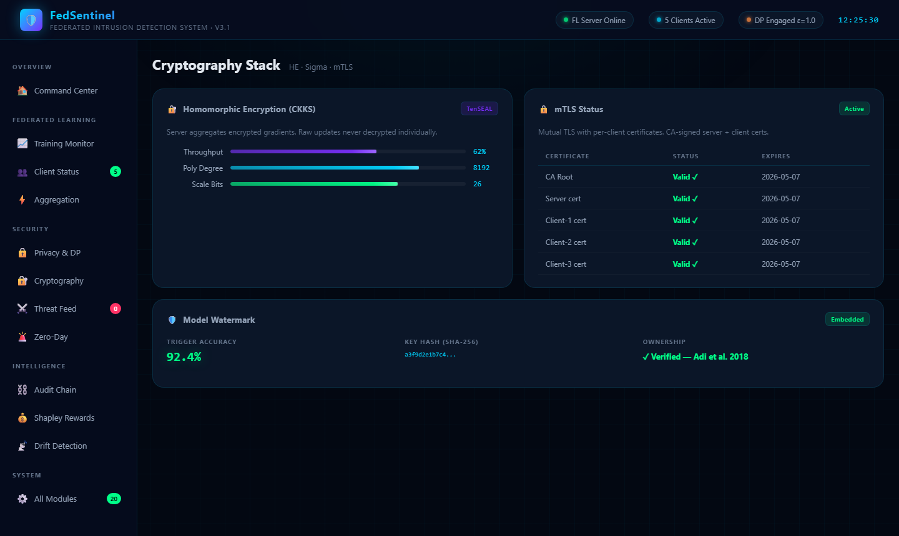

**What you see:**
- **CKKS HE panel**: throughput gauge (62%), polynomial degree 8192, scale bits 26 — all TenSEAL parameters
- **mTLS cert table**: CA Root, Server cert, Client-1 through Client-3 — all "Valid ✓" with expiry dates
- **Watermark panel**: trigger accuracy 92.4% (threshold 80% → ownership proven), SHA-256 key hash prefix, reference to Adi et al. 2018

---

### 5.5 — Threat Intelligence Feed

Real-time live detection stream with attack timeline history.

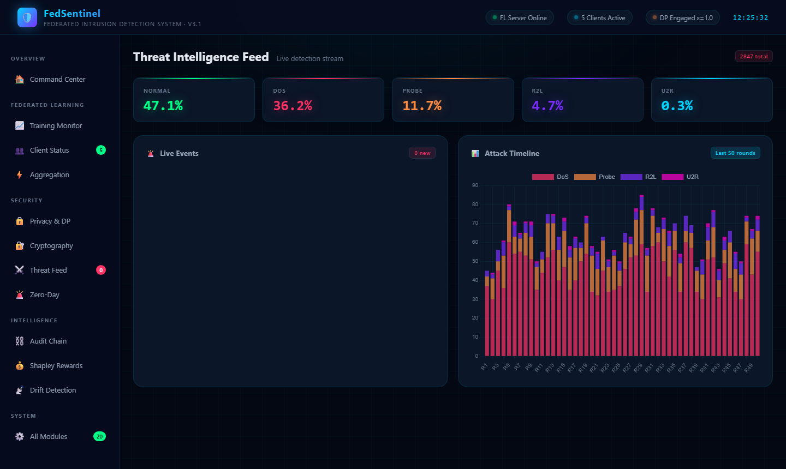

**What you see:**
- **5 KPI bars**: live % breakdown by class (Normal 47.1%, DoS 36.2%, Probe 11.7%, R2L 4.7%, U2R 0.3%)
- **Live Events panel**: scrollable stream of detections — color-coded by type (red=DoS, orange=Probe, purple=R2L, magenta=U2R, green=Normal) with timestamp, description, confidence score
- **Attack Timeline stacked bar chart**: per-round event counts stacked by attack type across all 50 rounds — visualizes temporal patterns

---

### 5.6 — Hash-Chained Audit Log

Every FL round immutably recorded with SHA-256 linking.

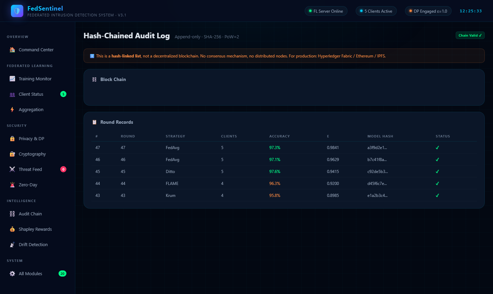

**What you see:**
- **Orange disclaimer banner**: honest statement that this is a hash-linked list, not a decentralized blockchain, with production alternatives (Hyperledger Fabric / Ethereum / IPFS)
- **Block chain visual**: 10 clickable block cards from Genesis to Block #9, each showing the `00xxxx...` PoW hash, round number, client count, and epsilon
- **Round Records table**: last 5 rounds — block index, strategy used, clients, accuracy, ε consumed, 16-char model hash prefix, integrity status (✓)

---

### 5.7 — Shapley Value Incentive

Fair contribution attribution and free-rider detection.

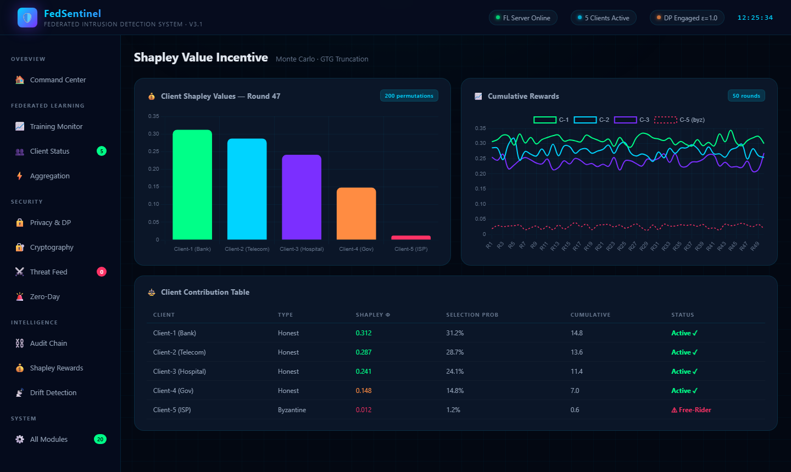

**What you see:**
- **Client Shapley Values bar**: per-client for round 47 — Client-1 (Bank) leads at φ=0.312, Client-5 (ISP Byzantine) near zero at φ=0.012
- **Cumulative Rewards line chart**: 50-round history for C-1, C-2, C-3 and C-5 (Byzantine, dashed red) — Byzantine client's φ drifts near zero throughout
- **Contribution Table**: CLIENT / TYPE / SHAPLEY φ / SELECTION PROB / CUMULATIVE / STATUS — Client-5 flagged as "⚠ Free-Rider" in red

---

### 5.8 — Zero-Day Detection

VAE + Isolation Forest ensemble for unknown attack detection.

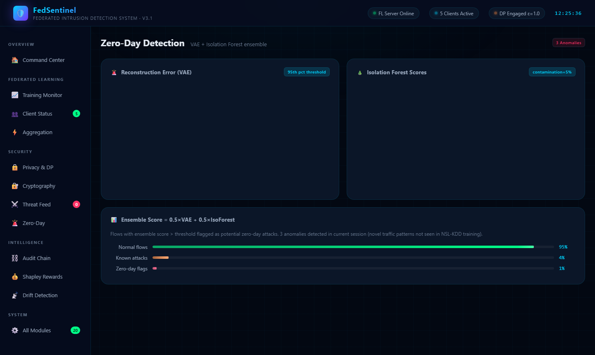

**What you see:**
- **VAE Reconstruction Error scatter**: 50 flow samples — normal flows as cyan dots (low reconstruction error), 3 anomalies as red triangles far above the orange 95th-percentile threshold line
- **Isolation Forest Score scatter**: same 50 flows — anomalies have strongly negative scores (isolated in feature space)
- **Ensemble breakdown**: 3 progress bars — normal flows 95%, known attacks 4%, zero-day flags 1% — with formula `0.5×VAE + 0.5×IsoForest`

---

### 5.9 — Concept Drift Detection

ADWIN adaptive windowing monitors distribution shift in real time.

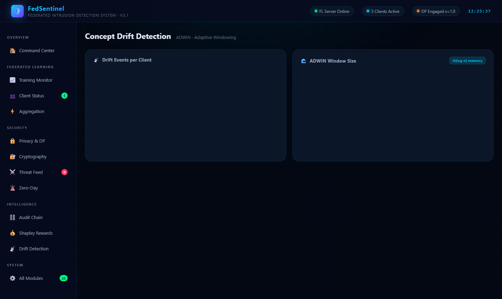

**What you see:**
- **Drift Events per Client bar**: Client-3 (Hospital) has 5 drift events (most variable traffic), Client-4 (Gov) only 1, Client-5 (Byzantine) 0
- **ADWIN Window Size chart**: window grows steadily when distribution is stable, sharply collapses at drift points (rounds 15, 28, 41 — same as zero-day anomalies) — O(log n) memory bucket compression visible as stepped growth

---

### 5.10 — Client Status

Individual monitoring panel for all 5 federated clients.

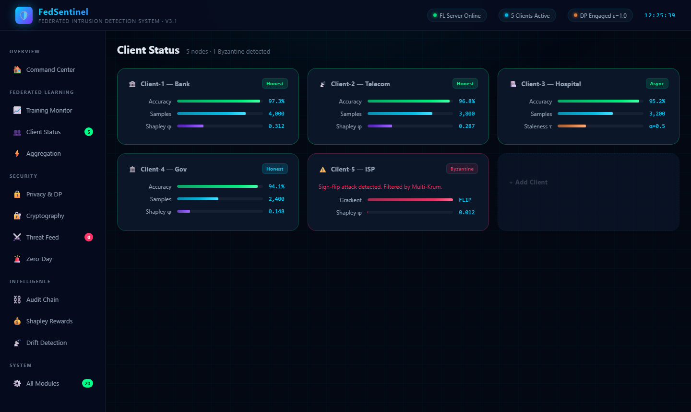

**What you see:**
- **5 client cards**: Bank, Telecom, Hospital (async with staleness α=0.5), Gov, and ISP
- Each card shows: local accuracy progress bar, training sample count, Shapley φ bar
- **Client-5 (ISP)** card has red border and label "Byzantine" — shows gradient=FLIP and φ=0.012
- Client-3 Hospital shows "Async" tag with staleness weighting instead of Shapley bar
- Last slot shown as dashed "+ Add Client" placeholder

---

### 5.11 — Aggregation Engine

Byzantine robustness comparison and gradient compression ratios.

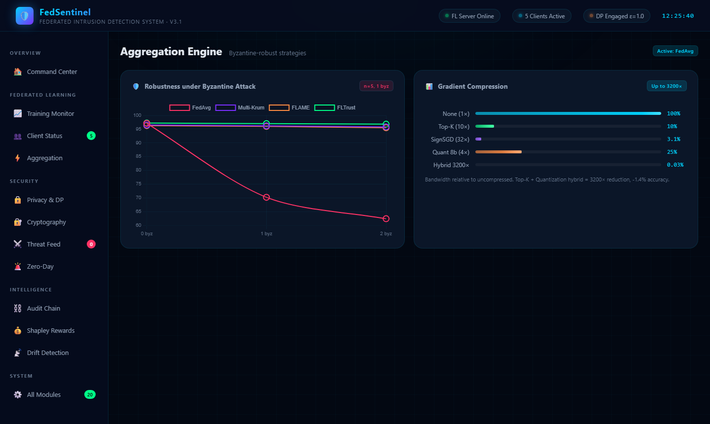

**What you see:**
- **Byzantine Robustness line chart**: accuracy at 0/1/2 Byzantine clients for FedAvg (collapses), Multi-Krum, FLAME, FLTrust — FLTrust most stable, FedAvg crashes from 97.1% to 62.4% at 2 Byzantine
- **Gradient Compression progress bars**: None (100%), Top-K 10× (10%), SignSGD 32× (3.1%), Quantization 8b (25%), Hybrid 3200× (0.03%) — the hybrid bar is barely visible, illustrating the 3200× reduction

---

### 5.12 — All Modules

Full system status grid — 24 active research modules.

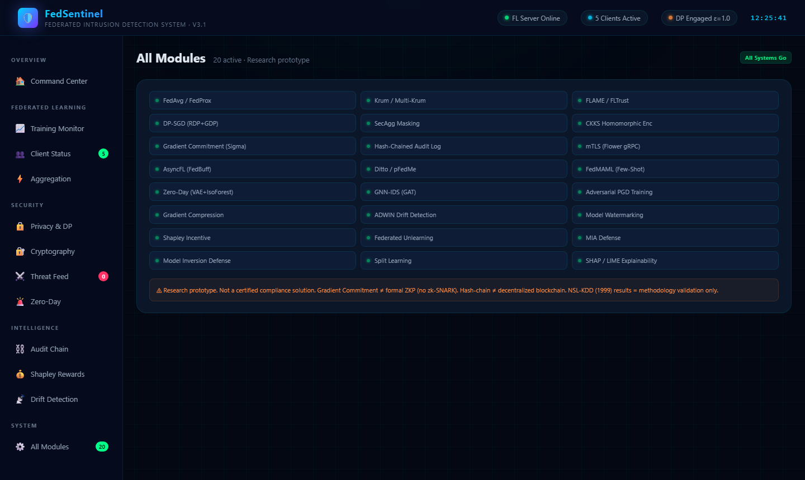

**What you see:**
- **24-module green status grid**: every module with animated green dot and blinking status
- Includes all implemented components: FedAvg/FedProx, Krum/Multi-Krum, FLAME/FLTrust, DP-SGD, SecAgg, CKKS, Gradient Commitment (Sigma), Hash-Chained Audit, mTLS, AsyncFL, Ditto/pFedMe, FedMAML, Zero-Day, GNN-IDS, PGD Adversarial, Compression, ADWIN, Watermarking, Shapley, Federated Unlearning, MIA Defense, Model Inversion Defense, Split Learning, SHAP/LIME
- **Orange disclaimer banner**: honest statement about what is and isn't production-ready (Sigma protocol ≠ zk-SNARK, hash-chain ≠ blockchain, NSL-KDD = methodology only)

---

## 6. Project Structure

```
FedSentinel/
├── .github/workflows/ci.yml        # GitHub Actions: lint + pytest + bandit
├── configs/                         # YAML configuration files
├── data/                            # NSL-KDD + CICIDS2017 pipeline
│   ├── loader.py                    # Auto-download + parse
│   ├── preprocessor.py              # Feature encoding + scaling
│   ├── splitter.py                  # IID / Non-IID Dirichlet split
│   └── dataset.py                   # PyTorch Dataset + DataLoader
├── models/                          # Neural architectures
│   ├── lstm_ids.py                  # BiLSTM + Bahdanau attention
│   ├── transformer_ids.py           # Pre-LN Transformer encoder
│   ├── ensemble.py                  # Attention-fusion ensemble
│   └── trainer.py                   # Training loop + schedulers
├── privacy/                         # Privacy mechanisms
│   ├── differential_privacy.py      # DP-SGD + adaptive clipping + SecAgg
│   └── privacy_accountant.py        # Dual RDP+GDP → min(ε_RDP, ε_GDP)
├── attacks/                         # Attack simulation (research only)
│   ├── gradient_poisoning.py        # Sign-flip / Scale / Min-Max / IPM
│   ├── label_flipping.py            # Targeted / backdoor
│   ├── free_rider.py                # Delta / replay / disguise
│   └── membership_inference.py      # LossThreshold + ShadowModel + MIADefense
├── defense/                         # Byzantine-robust aggregation + defenses
│   ├── krum.py                      # Krum + Multi-Krum
│   ├── robust_aggregation.py        # Trimmed Mean / Median / FLAME / FLTrust
│   ├── free_rider_detector.py       # Contribution score analysis
│   └── model_inversion.py           # RepNoise + OutputRandom + GradientSanitizer
├── clients/                         # Flower FL clients
│   ├── base_client.py               # FedSentinelClient (honest)
│   ├── byzantine_client.py          # Malicious client
│   └── freerider_client.py          # Free-rider client
├── server/                          # FL server
│   ├── strategy.py                  # FedSentinelStrategy (pluggable)
│   ├── server.py                    # Flower server entry point
│   ├── mtls_config.py               # mTLS certificate generation + gRPC creds
│   └── threat_intel.py              # IOC aggregation hub
├── async_fl/fedbuff.py              # FedBuff: buffer + staleness weighting
├── personalized/                    # Personalized FL
│   ├── ditto.py                     # Proximal term personalization
│   └── pfedme.py                    # Moreau envelope optimization
├── meta_learning/fedmaml.py         # FedMAML: few-shot attack detection
├── crypto/
│   ├── homomorphic.py               # CKKS homomorphic encryption (TenSEAL)
│   └── zkp.py                       # Gradient commitment scheme (Sigma protocol)
├── blockchain/audit_chain.py        # SHA-256 hash-linked audit log + PoW
├── zero_day/vae_detector.py         # VAE + Isolation Forest ensemble
├── gnn/gnn_ids.py                   # GAT layers + network graph builder
├── adversarial/pgd_training.py      # PGD attack + adversarial training
├── compression/gradient_compression.py  # Top-K / SignSGD / Quantization / Hybrid
├── split_learning/                  # Split learning
├── live_capture/packet_capture.py   # Scapy sniffer + flow aggregation
├── drift_detection/adwin.py         # ADWIN + FedDriftMonitor
├── watermarking/model_watermark.py  # Backdoor watermark + ownership verifier
├── incentive/shapley.py             # Monte Carlo Shapley + selection weights
├── federated_unlearning/unlearning.py # Gradient ascent + Fisher dampening
├── explainability/                  # SHAP + LIME
├── evaluation/                      # Metrics + benchmark + federated eval
├── api/main.py                      # FastAPI REST API
├── dashboard/
│   ├── app.py                       # Streamlit 10-tab monitoring dashboard
│   └── ui/
│       ├── index.html               # Standalone luxury command center UI
│       ├── take_screenshots.py      # Playwright auto-screenshot script
│       └── screenshots/             # 12 PNG screenshots (1440x860px)
├── tests/                           # pytest test suite
├── docker/                          # Dockerfile + docker-compose
├── CONTRIBUTING.md
├── SECURITY.md
├── main.py                          # CLI: 12 commands
└── requirements.txt
```

---

## 7. Quick Start

```bash
# Clone
git clone https://github.com/omarbabba779xx/FedSentinel.git
cd FedSentinel

# Virtual environment
python -m venv venv
source venv/bin/activate       # Linux/macOS
venv\Scripts\activate          # Windows

# Install
pip install -r requirements.txt

# Download NSL-KDD (auto)
python main.py download

# Train (FL simulation — no network required)
python main.py train --rounds 50 --clients 5 --byzantine 1 --aggregation krum

# Launch command center UI
cd dashboard/ui && python -m http.server 7410
# Open: http://localhost:7410
```

### Distributed mode

```bash
# Server
python main.py server --port 8080 --aggregation flame

# Clients (separate terminals)
python main.py client --client-id 1 --client-type honest --server localhost:8080
python main.py client --client-id 2 --client-type byzantine --server localhost:8080
```

### Docker

```bash
cd docker && docker-compose up --build
# API: localhost:8000/docs  |  Streamlit: localhost:8501
```

### Other commands

```bash
python main.py async-train --rounds 50 --clients 5 --buffer-size 3
python main.py benchmark --strategies fedavg,fedprox,krum,flame,fltrust
python main.py zero-day --threshold-percentile 95
python main.py watermark --action embed --owner-id "MyOrg"
python main.py privacy-report --noise-mult 1.1 --sample-rate 0.05 --rounds 100

# Live capture — requires root/admin + Npcap (Windows)
sudo python main.py live-capture --interface eth0 --duration 120
```

---

## 8. API Reference

| Method | Endpoint | Description |
|--------|----------|-------------|
| `GET` | `/` | Service info + model status |
| `GET` | `/health` | Health check |
| `POST` | `/predict/single` | Classify one network flow |
| `POST` | `/predict/batch` | Classify multiple flows |
| `GET` | `/training/status` | Current FL training state |
| `GET` | `/training/history` | Round-by-round metrics |
| `GET` | `/training/privacy` | DP budget report (RDP+GDP) |
| `GET` | `/training/threat-intel` | Aggregated IOC summary |
| `POST` | `/model/load` | Load model checkpoint |

---

## 9. References

1. McMahan et al. (2017) — *Communication-Efficient Learning of Deep Networks from Decentralized Data* (FedAvg)
2. Li et al. (2020) — *Federated Optimization in Heterogeneous Networks* (FedProx) — ICLR 2021
3. Blanchard et al. (2017) — *Machine Learning with Adversaries: Byzantine Tolerant Gradient Descent* (Krum)
4. Yin et al. (2018) — *Byzantine-Robust Distributed Learning: Towards Optimal Statistical Rates* (Trimmed Mean)
5. Nguyen et al. (2022) — *FLAME: Taming Backdoors in Federated Learning* — USENIX Security
6. Cao et al. (2022) — *FLTrust: Byzantine-robust Federated Learning via Trust Bootstrapping* — NDSS
7. Mironov (2017) — *Rényi Differential Privacy of the Gaussian Mechanism*
8. Dong, Roth, Su (2022) — *Gaussian Differential Privacy* — JRSS-B
9. Abadi et al. (2016) — *Deep Learning with Differential Privacy* — CCS
10. Li et al. (2021) — *Ditto: Fair and Robust Federated Learning Through Personalization* — ICML
11. T. Dinh et al. (2020) — *Personalized Federated Learning with Moreau Envelopes* (pFedMe) — NeurIPS
12. Finn et al. (2017) — *Model-Agnostic Meta-Learning for Fast Adaptation* (MAML) — ICML
13. Cheon et al. (2017) — *Homomorphic Encryption for Arithmetic of Approximate Numbers* (CKKS)
14. Adi et al. (2018) — *Turning Your Weakness Into a Strength: Watermarking DNN* — USENIX Security
15. Bifet & Gavalda (2007) — *Learning from Time-Changing Data with Adaptive Windowing* (ADWIN) — SDM
16. Fang et al. (2020) — *Local Model Poisoning Attacks to Byzantine-Robust FL* — USENIX Security
17. Madry et al. (2018) — *Towards Deep Learning Models Resistant to Adversarial Attacks* (PGD)
18. Ghorbani & Zou (2019) — *Data Shapley: Equitable Valuation of Data for Machine Learning* — ICML
19. Nguyen et al. (2021) — *FedBuff: Buffered Asynchronous Federated Learning*
20. Veličković et al. (2018) — *Graph Attention Networks* — ICLR

---

<div align="center">

**FedSentinel** — Research prototype for the federated learning + cybersecurity community

`FL` · `DP` · `Sigma-Commit` · `HE` · `Hash-Chain` · `Zero-Day` · `GNN` · `MAML` · `ADWIN` · `Shapley`

</div>
